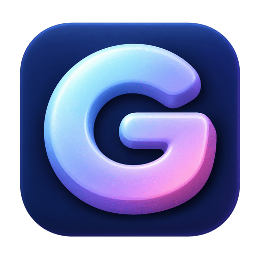
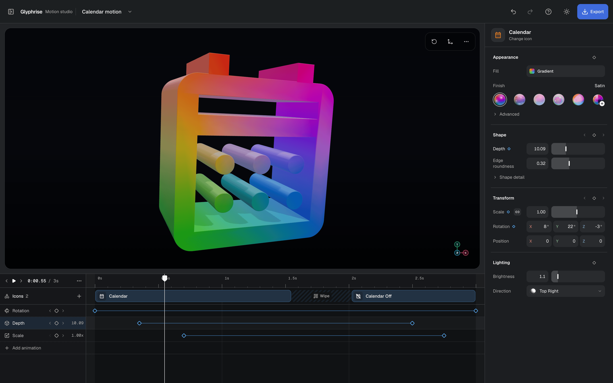

  

<h1 align="center">Glyphrise</h1>

  <strong>Give your icons another dimension.</strong> 
  Turn SVG icons into 3D artwork and animation, right in your browser.

  <a href="https://glyphrise.vercel.app">Try Glyphrise</a> ·
  <a href="#make-your-first-icon">Get started</a> ·
  <a href="#exports">Exports</a>

Pick an icon or bring your own SVG. Give it depth, choose a finish, then make
it spin, tilt, or pulse. Export an image, video, or 3D model for your next
interface, illustration, or motion project. No account required.

- **Shape and style.** Depth, bevels, lighting, material finishes, solid colors,
  and editable gradients, including mesh palettes.
- **Make it move.** Spin, Tilt, and Pulse presets with editable keyframes,
  easing, snapping, and timeline zoom.
- **Build a sequence.** Arrange icon clips, add fades or directional wipes,
  and animate transforms, depth, colors, materials, and lighting.
- **Refine the details.** Edit individual SVG paths and use Canvas, Properties,
  and Motion views on smaller screens.
- **Keep your work.** Local autosave, named projects, duplication, undo/redo,
  and portable project files.

## Make your first icon

1. **Choose artwork.** Start with Calendar, Heart, Wi-Fi off, or Bell, browse
   Material Symbols, or use **Use my SVG** to import your own.
2. **Style it.** Pick a finish and color or gradient, then adjust **Depth**
   and **Edge roundness** in Properties.
3. **Animate it.** Open **Animate** for Spin, Tilt, or Pulse. Use **Add property**
   in the timeline to combine motions, then drag the diamonds to adjust timing.
4. **Export it.** Press **Play** to preview, then **Export** to download an
   image, video, or GLB model.

Try the [Calendar sample project](docs/calendar-motion.glyphrise.json) for
staggered rotation, depth, and scale animation with a Calendar → Calendar Off
wipe. Download the JSON and choose **Open from computer** in the file menu.

### Controls

| Action                    | Control                                        |
| ------------------------- | ---------------------------------------------- |
| Rotate the artwork        | Drag the canvas                                |
| Zoom                      | Scroll or pinch the canvas                     |
| Play / pause              | **Play** or `Space` with the workspace focused |
| Step one frame            | `←` / `→` with the timeline focused            |
| Step ten frames           | `Shift` + `←` / `→` with the timeline focused  |
| Previous / next keyframe  | Transport arrows or `,` / `.`                  |
| Undo / redo               | `⌘/Ctrl Z` / `⌘/Ctrl Shift Z`                  |
| Edit a keyframe precisely | Double-click a diamond, or tap a selected one  |

Canvas rotation changes the artwork's Rotation controls and its exported pose.
**Reset view** restores transforms and zoom when paused; during playback it
resets zoom without adding keyframes.

Editing an animated property creates or updates a keyframe at the playhead.
Enable **Auto-key** to start keyframing a property that has no animation yet.

## Exports

| Format         | What you get                                                                                                                              |
| -------------- | ----------------------------------------------------------------------------------------------------------------------------------------- |
| **PNG**        | The current frame, with a transparent or solid background and dimensions up to 4096 px per side.                                          |
| **WebM / MP4** | The animated timeline at 24, 30, or 60 fps. Format and transparency support depend on your browser and codec.                             |
| **GLB**        | A binary glTF file with geometry, textures, PBR materials, and supported transform/depth animation. Wipes and custom shaders are omitted. |

**Code exports** provide a React Three Fiber component or an Android Filament
viewer starter. The React component includes timing, transforms, wipes, colors,
and lighting, with simplified mesh gradients and custom finishes. The Android
starter displays the exported GLB without playing its timeline; save the model
at `app/src/main/assets/exports/icon.glb`. Check generated code and appearance
in your target runtime.

## Your files

Projects autosave in this browser. Rendering and exports run on your device;
there is no account or cloud sync.

Open the file menu beside the project name. **All files** lets you create,
switch, duplicate, or delete projects. **Download a copy** saves a portable
JSON file; **Open from computer** restores one. Clearing browser site data
removes local projects, so keep copies of work you want to save or move.

## Compatibility

Use a browser with **WebGL2**. Video export checks available codecs; Material
Symbols and web fonts require network access.

For SVG imports, use a `viewBox`, outline text, expand strokes, and flatten
effects. Plain paths, basic shapes, and groups work best. Filters, masks,
embedded images, external references, and other unsupported SVG content are
rejected. Imports are sanitized before use.
